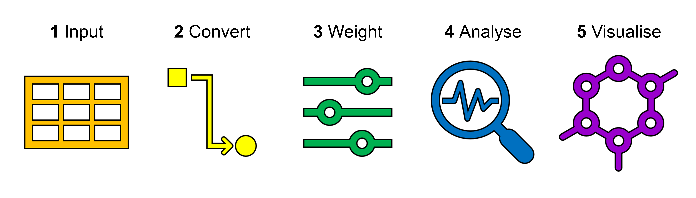

# `AHgen`

 

## What is `AHgen`?

`AHgen` was created to generate, analyse, compare, and visualise Abstraction Hierarchies. Historically, applications of the Abstraction Hierarchy method aimed to visualise and inspect the network, relying on pen-and-paper methods, PowerPoint drawing, or proprietary software. `AHgen` brings the Abstraction Hierarchy into the 21st century with an open source software code in R.

`AHgen` was developed to compare Urban Systems Abstraction Hierarchy (USAH) scenarios for UK cities as part of the Water Resilient Cities project (EPSRC EP/N030419/1), using outputs from [`OSMtidy`](https://github.com/avisserquinn/OSMtidy). Additionally, its underlying functions may be adapted to analyse Abstraction Hierarchies in any domain or at any scale.

## `AHgen` workflow and functions

`AHgen` is extremely flexible, with lots of possible workflows. There are five families of functions: 

1. **Input** Reading in the Abstraction Hierarchy and accompanying data
2. **Convert** Converting the Abstraction Hierarchy into formats compatible with network analysis in R
3. **Weight** Weighting edges
4. **Analyse** Applying network analysis, plus summarising, comparing, and exporting outputs
5. **Visualise** Visualising the Abstraction Hierarchy and results

</p

There are six vignettes designed to get you on your way:

- Vignette 0 - [Welcome to AHgen](https://avisserquinn.github.io/AHgen/vignettes/Vignette-0---Welcome-to-AHgen.html)
- Vignette 1 - [Getting started](https://avisserquinn.github.io/AHgen/vignettes/Vignette-1---Getting-started.html)
- Vignette 2 - [Input & Convert](https://avisserquinn.github.io/AHgen/vignettes/Vignette-2---Input---Convert.html)
- Vignette 3 - [Weight](https://avisserquinn.github.io/AHgen/vignettes/Vignette-3---Weight.html)
- Vignette 4 - [Analyse - Core functions](https://avisserquinn.github.io/AHgen/vignettes/Vignette-4---Analyse---Core-functions.html)
- Vignette 5 - [Analyse - Additional functions](https://avisserquinn.github.io/AHgen/vignettes/Vignette-5---Analyse---Additional-functions.html)
- Vignette 6 - [Visualise](https://avisserquinn.github.io/AHgen/vignettes/Vignette-6---Visualise.html)

## Applications
`AHgen` can be applied to Abstraction Hierarchies in any domain at any scale for various objectives.

Five walkthrough vignettes are provided to illustrate the application of `AHgen` to create and explore the Urban Systems Abstraction Hierarchy (USAH).

- Vignette 7A - [Application - Generate template Urban Systems Abstraction Hierarchy](https://avisserquinn.github.io/AHgen/vignettes/Vignette-7A---Application---Generate-template-Urban-Systems-Abstraction-Hierarchy.html)
- Vignette 7B - [Application - Apply OSMtidy data](https://avisserquinn.github.io/AHgen/vignettes/Vignette-7B---Application---Apply-OSMtidy-data.html)
- Vignette 7C - [Application - Introduce flood](https://avisserquinn.github.io/AHgen/vignettes/Vignette-7C---Application---Introduce-flood.html)
- Vignette 7D - [Application - Introduce other hazards](https://avisserquinn.github.io/AHgen/vignettes/Vignette-7D---Application---Introduce-other-hazards.html)
- Vignette 7E - [Application - Compare scenarios](https://avisserquinn.github.io/AHgen/vignettes/Vignette-7E---Application---Compare-scenarios.html)

## Further information

### Acknowledgements
`AHgen` was developed to compare Urban Systems Abstraction Hierarchy (USAH) scenarios for UK cities as part of the Water Resilient Cities project (EPSRC EP/N030419/1).

### Contact 
If you have any questions about using or running the code, please contact [Melissa Bedinger](dr.m.bedinger@gmail.com). 

### Citation
Visser-Quinn, A., Bedinger, M., Aitken, G., & Songchon, C. (2023). AHgen **v1.0.0**. 
https://doi.org/10.5281/zenodo.8187279 