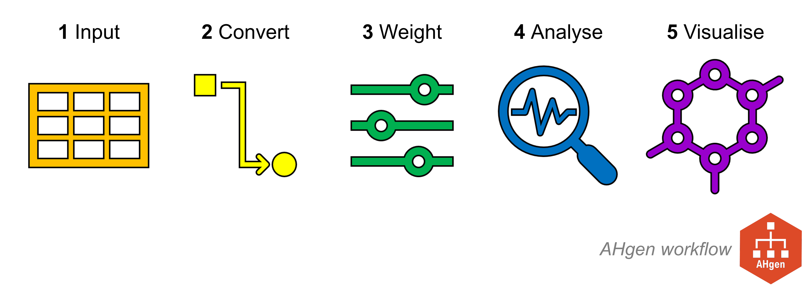

# Summary

`AHgen` (Abstraction Hierarchy Generator) is an R package to generate, analyse, compare, and visualise Abstraction Hierarchies. `AHgen` was developed as part of the Water Resilient Cities project (EPSRC EP/N030419/1), to compare Urban Systems Abstraction Hierarchy (USAH) scenarios for UK cities using outputs from `OSMtidy`. Its functions may be applied to analyse Abstraction Hierarchies in any domain or at any scale.

# Statement of need

`AHgen` (Abstraction Hierarchy Generator) is an R package to generate, analyse, compare, and visualise Abstraction Hierarchies. The Abstraction Hierarchy is a method from the discipline of human factors, as one part of the Cognitive Work Analysis framework (@jenkins2009). Originally developed to improve the design of safety-critical work systems (e.g., a nuclear power plant), this has also been applied to map and explore systems at any scale – from microwaves to transport systems to entire cities.

The Abstraction Hierarchy is a hierarchical network, wherein:

- Vertices (aka nodes) are structured across five levels of increasing abstraction, from physical objects to the functional purpose(s) of the system.
- Edges (aka links) connect vertices between two levels (a layer), to represent the functional connections between the physical and abstract parts of a system.

{ width=80% }

At the bottom of the hierarchy are the Resources (Level 5). These object types are linked to Processes (Level 4) they support, then to Tasks (Level 3) they achieve, then to Outcomes (Level 2), and finally to Purposes (Level 1). These system parts are nodes, which are linked between levels through their functionality, connecting the physical to the abstract. Moving upward through the levels the nodes are connected by asking ‘why the node exists’; moving downward levels the nodes are connected by asking ‘how a node is afforded’. These links represent the ‘means’ that a system can use to achieve defined ‘ends’, explicitly connecting the physical and abstract. By understanding how physical objects connect to different – yet interdependent – functions, we can improve the design of the system.

Historically, applications of the Abstraction Hierarchy method aimed to visualise and inspect the network, relying on pen-and-paper methods, PowerPoint drawing, or proprietary software. `AHgen` brings the Abstraction Hierarchy into the 21st century with an open source software code in R. This enables a user to not only quickly and repeatably visualise the network, but also modify and analyse it in a standardised manner.

`AHgen` was developed as part of the Water Resilient Cities project (EPSRC EP/N030419/1). The project developed an Urban Systems Abstraction Hierarchy (USAH) template (@bedinger2020; @mcclymont2022), to enable comparisons between UK cities using outputs from `OSMtidy`. Its functions may be applied to Abstraction Hierarchies in any domain or at any scale.

`AHgen` is extremely flexible, with many possible workflows. There are five families of functions: 

1. **Input** Reading in the Abstraction Hierarchy and accompanying data
2. **Convert** Converting the Abstraction Hierarchy into formats compatible with network analysis in R
3. **Weight** Weighting edges
4. **Analyse** Applying network analysis, plus summarising, comparing, and exporting outputs
5. **Visualise** Visualising the Abstraction Hierarchy and results

{ width=70% }

`AHgen` was designed to be used both by researchers and students, across human factors, climate impacts, and more. It has been used in a number of scientific publications (e.g. @beevers2022a, @beevers2022b, @mcclymont2023, @bedinger2023). It has also been used in international research projects, and undergraduate and postgraduate research dissertations. Some `AHgen` functions have wider applications for network analysis in any domain. For example, the function `sbc_norm()` was developed based on the work of @segarra2014 to calculate Stable Betweenness Centrality, a metric for which there does not appear to be an existing function in the R ecosystem. In a teaching environment, `AHgen` can be used in courses related to human factors and systems analysis.

`AHgen` is supported by vignettes that provide the background to its development, clear installation instructions, step-by-step tutorials to introduce and demonstrate functions, and beginner guidance on the interpretation of network analysis results for Abstraction Hierarchies. It was also designed to accommodate future developments, such as the inclusion of additional network metrics and more sophisticated network representations such as hypergraphs.

# Acknowledgements

`AHgen` was developed to compare Urban Systems Abstraction Hierarchy (USAH) scenarios for UK cities as part of the Water Resilient Cities project (EPSRC EP/N030419/1).

# References